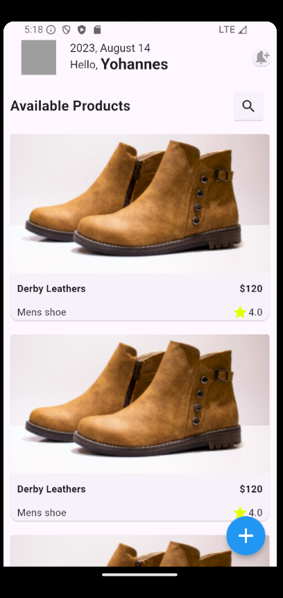

# ecommerceapp

A new Flutter project for an e-commerce application.

## Overview

The **ecommerceapp** is a Flutter-based mobile application designed to provide a seamless shopping experience. The app features a list of products where users can view details, search for specific items, and update the product catalog. The main features include:

- **Product Listing**: View a list of available products with detailed descriptions, prices, and images.
- **Product Search**: Search through the list of products to quickly find specific items.
- **Product Management**: Add new products or remove existing ones using a user-friendly interface.
- **Product Details**: View detailed information about a product by clicking on it.

### Screenshots




## How to Run the App

To run this application locally, follow these steps:

1. **Clone the Repository**:
   ```bash
   git clone https://github.com/surraaI/2024-project-phase-mobile-tasks
   cd 2024-project-phase-mobile-tasks/mobile/Sura/ecommerceapp
   flutter pub get
   flutter run

